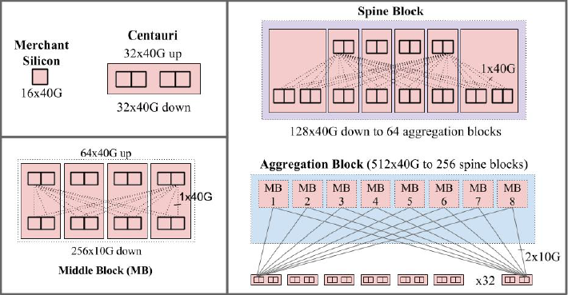
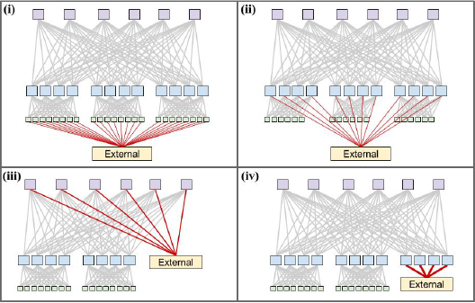

## Topology
One of the defining characteristics of a Clos topology is *disaggregation* of the network. Traditional cluster architectures present limitations on performance and cost, usually requiring a lot more cabling and building in redundancy to cover the event of a failure. Furthermore, to meet desired bandwidth increases, the cost may be very significant. Rather than scaling up (e.g., buying a beefier box to provide more processing on the network), a Clos topology allows for the network to scale out, adding more switches to easily spread out the load across the network, and providing for multiple redundant paths to the same nodes.

Both Google and Facebook employ a three-tier Clos topology, but they implement their topologies in different ways.

### Google
Google has sequenced through to their fifth generation of a fabric architecture, which they have named Jupiter. Originally deployed in 2012, Jupiter is the first iteration of their fabric architecture to support speeds of 40G, thanks to denser merchant fabric. Jupiter was also slated to scale to more than six times the size of their then-current largest fabric, an upgrade which could not happen all at once. Therefore, unique to Jupiter was that the fabric needed to support heterogeneous hardware and speeds, as well as be able to react robustly and gracefully to events in the now very broad network. 

Building out Jupiter would require approaching it through individual building blocks, instead of treating the network holistically and applying the fabric-wide decisions to each individual component. Eventually, they decided to bridge between the approaches in Firehose (first- and second-generation fabric network, with each switch cabled to others) and Watchtower and Saturn (third- and fourth-generation fabric networks, with the largest possible chassis), sticking with a chassis-based Clos topology. The building blocks are seen here:

The unit of deployment, named Centauri, had four switch chips with 16x40G ports. The ports could be configured as 4x10G or 40G mode, with all ports accessible on the front panel of the chassis. Employed as a ToR, the Centauri chassis was configured with each switch chip as a separate subnet of machines, for organizational purposes. Each chip was configured with 48x10G for server-facing ports and 16x10G for fabric-facing ports. 

Four Centauri comprised a Middle Block for use in the aggregation block, which was designed as a 2-stage blocking network with 256x10G available for ToR and 64x40G available for the fabric. Each ToR chip connected to eight Middle Blocks, with dual redundant links. Each aggregation block exposed 40G ports to the spine blocks, at either *full pop* with 512 ports available or *depop*, which had half of this number, 256.

Six Centauri created a spine block, which exposed 128x40G to the aggregation blocks. Jupiter was limited to 64 aggregation blocks to allow for full dual redundancy from each spine block to each aggregation block. In its largest configuration, Jupiter supports 1.3 Pbps bisection bandwidth among servers.

#### External Connectivity
Google takes an intentional approach to incorporating and isolating connectivity to external networks (i.e., the Internet) from their fabric topology. They sought a way to connect their external routers directly to the fabric. They explored four options, depicted graphically below: (i) reserve some links from each ToR, (ii) reserve ports in each aggregation block, (iii) reserve ports in each spine block, or (iv) build a separate aggregation block for external connectivity.

The decision Google went with was option (iv), to build out an isolated layer of switches to peer with external routers, so as to limit the domain against which external-facing configurations needed to be applied and against which they would need to integrate their in-house routing protocols with external routing protocols. They allocated 10% of aggregate intra-cluster bandwidth for external connectivity using one to three aggregation blocks, which are identical to the aggregation blocks used for ToR connectivity, just with the ports reallocated for external connections.

### Facebook
